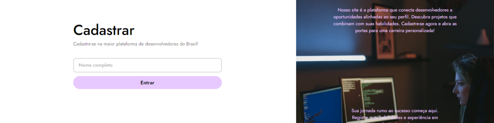

## Access the Project

https://renancardosodev.github.io/cadastrodedev/

## Description

This is a Developer Registration Form project developed in HTML, CSS, and JavaScript. The purpose is to create a simple and user-friendly interface for developers to register their skills and experience.

## Features

- **Initial Input:**
  - Users enter the developer's full name and press the "Enter" button.

- **Add Skills:**
  - After pressing "Enter," new inputs appear where the user can enter the technologies they are familiar with.
  - Users select the time of experience for each technology using radio inputs: 0-2 years, 3-4 years, 5+ years.
  - Users can add as many technologies as they want.

- **Submit Form:**
  - After entering all the information, users press the "Submit" button.
  - A congratulatory message appears.

- **Data Validation:**
  - Validation ensures that the user provides accurate information.

- **Responsive Design:**
  - The form adapts to different screen sizes for a consistent experience on various devices.

- **Technologies Used:**
  - HTML / CSS / JavaScript

## How to Contribute

If you want to contribute to the development of this project, follow the steps below:

1. Fork the repository.
2. Clone the forked repository to your local environment.
3. Create a branch for your contribution: `git checkout -b your-branch-name`.
4. Make desired changes to the code.
5. Commit the changes: `git commit -m "Description of changes"`.
6. Push to the branch: `git push origin your-branch-name`.
7. Open a Pull Request in the original repository.

## Screenshots

  
  

## Development Environment

Make sure to have a development environment set up with a compatible web browser. We recommend using VSCode as the code editor.

# Author

Renan Cardoso da Silva

[LinkedIn](https://www.linkedin.com/in/renancardosodev)
